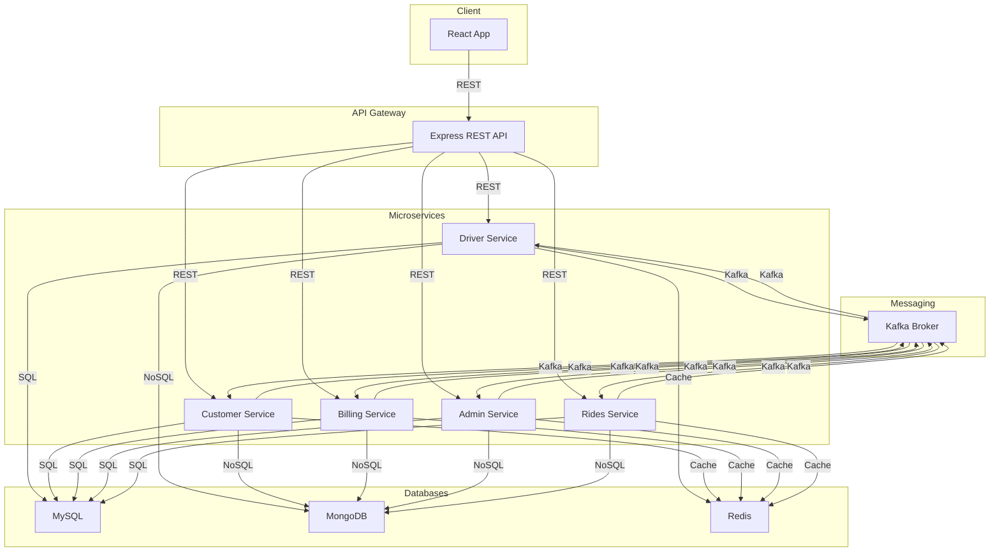
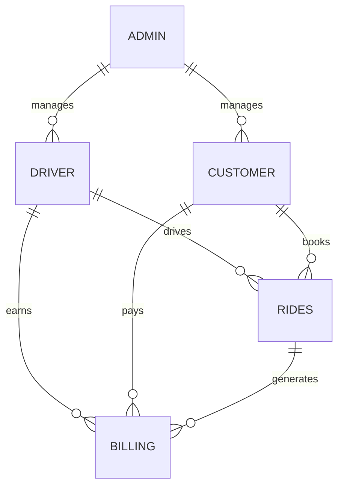
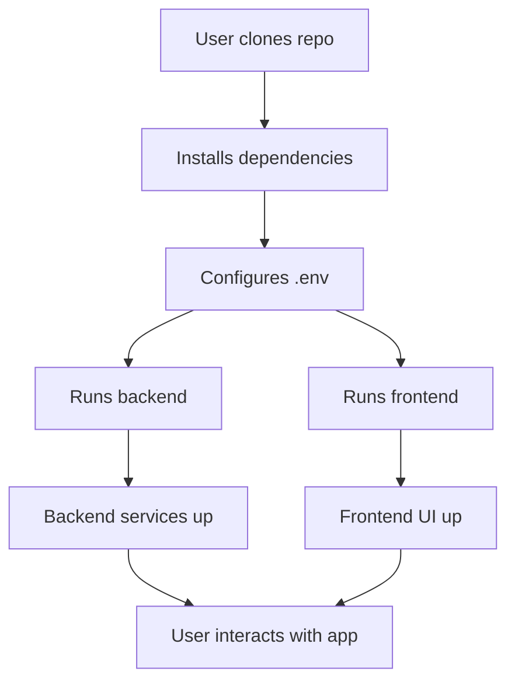

# Uber Distributed Ride Simulation

## Project Overview
A distributed, scalable simulation of the Uber ride-hailing platform, built for a data engineering distributed systems course. The system models real-world Uber operations, including dynamic pricing, driver/customer management, billing, and analytics, using a modern 3-tier architecture.

---

## Architecture Diagram



---

## Entity-Relationship Diagram



---

## Quickstart Flow



---

## Features
- **Driver, Customer, Billing, Admin, and Rides modules**
- Dynamic pricing algorithm using ML and Kaggle Uber Fares dataset
- RESTful API with robust validation and error handling
- SQL caching with Redis for performance
- Kafka-based messaging for distributed services
- Scalable database (MySQL/MongoDB) for entity storage
- Admin analytics: revenue, rides, area-wise stats, charts
- Test harness for scalability and robustness
- Dockerized deployment, AWS/Kubernetes ready
- Modern React frontend with MUI and Recharts

## Architecture
- **Frontend:** React, MUI, Recharts
- **Middleware:** Node.js, Express, KafkaJS, Redis, REST APIs
- **Database:** MySQL (core), MongoDB (media, reviews)
- **Messaging:** Kafka
- **Caching:** Redis

## Folder Structure
```
backend/
  services/        # Microservices for each module
  models/          # Data models (ORM/ODM)
  database/        # DB connectors and init scripts
  kafka/           # Kafka producer/consumer
  cache/           # Redis caching
  utils/           # Validators, constants
  tests/           # Test harness
frontend/
  src/components/  # UI components
  src/pages/       # Page-level views
  src/utils/       # API helpers
  public/          # Static files
  assets/          # Images, videos
scripts/           # DB population, performance tests
docs/              # API, DB, architecture, pricing docs
.github/workflows/ # CI/CD
```

## Setup & Usage
1. **Clone the repo**
2. **Install dependencies**
   ```bash
   npm install
   cd frontend && npm install
   ```
3. **Configure environment**
   - Copy `.env.example` to `.env` and set DB/Kafka/Redis credentials
4. **Run services**
   ```bash
   npm run dev         # Start backend (with nodemon)
   cd frontend && npm start  # Start frontend
   ```
5. **Run tests**
   ```bash
   node backend/tests/test_harness.js
   ```
6. **Docker Compose**
   ```bash
   docker-compose up --build
   ```

## Tech Stack
- Node.js, Express, React, MySQL, MongoDB, Redis, Kafka, Docker, AWS, MUI, Recharts

## Contribution
- Fork, branch, PR with clear commit messages
- See `CONTRIBUTING.md` for details

## License
MIT
