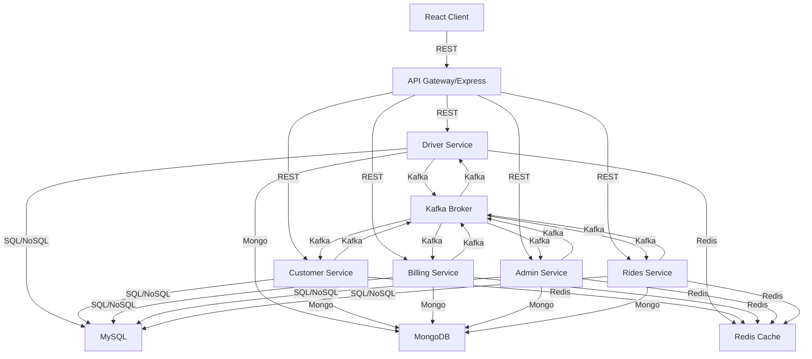

# System Architecture

## Overview
The Uber Distributed Ride Simulation system is designed as a scalable, distributed 3-tier application with microservices, messaging, caching, and robust data storage.

## Architecture Diagram

## Service Decomposition
- **API Gateway**: Routes requests, handles auth, aggregates responses
- **Driver/Customer/Billing/Admin/Rides Services**: Each is a stateless Node.js microservice, communicating via REST and Kafka
- **Kafka**: Event-driven communication, decouples services, enables async processing
- **MySQL**: Stores core entity data (drivers, customers, rides, billing, admin)
- **MongoDB**: Stores media (images, videos), reviews, ride images
- **Redis**: Caches frequent queries (e.g., entity lookups, stats)

## Data Flow
1. Client sends REST request to API Gateway
2. Gateway routes to appropriate service
3. Service processes request, interacts with DB/cache, emits Kafka events
4. Other services consume events as needed (e.g., billing after ride creation)
5. Responses are returned to client

## Deployment
- **Docker Compose**: For local development, all services, DBs, Kafka, Redis run as containers
- **AWS/Kubernetes**: For production, each service is a pod, with managed RDS (MySQL), MSK (Kafka), ElastiCache (Redis), and DocumentDB (MongoDB)
- **CI/CD**: GitHub Actions for build/test/deploy

## Scalability & Reliability
- Stateless services, horizontal scaling
- Kafka for decoupling and resilience
- Redis for performance
- DB sharding/replication as needed

## Notes
- See `docker-compose.yml` for local setup
- See `scripts/performance_test.js` for scalability tests
