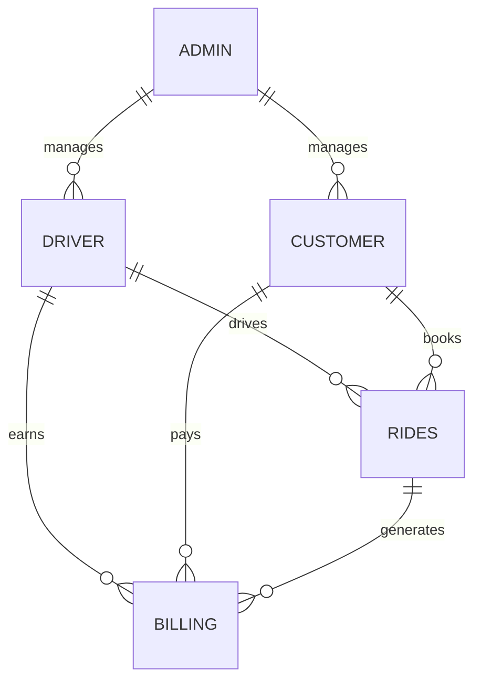

# Database Schema

## MySQL Schema (Core Entities)

### Driver
| Field         | Type         | Constraints         |
|--------------|--------------|--------------------|
| driver_id     | VARCHAR(11)  | PRIMARY KEY, SSN   |
| first_name    | VARCHAR(50)  | NOT NULL           |
| last_name     | VARCHAR(50)  | NOT NULL           |
| address       | VARCHAR(100) | NOT NULL           |
| city          | VARCHAR(50)  | NOT NULL           |
| state         | VARCHAR(20)  | NOT NULL           |
| zip_code      | VARCHAR(10)  | NOT NULL           |
| phone         | VARCHAR(20)  | NOT NULL           |
| email         | VARCHAR(100) | NOT NULL, UNIQUE   |
| car_details   | VARCHAR(100) |                    |
| rating        | FLOAT        | DEFAULT 5.0        |
| reviews       | TEXT         |                    |

### Customer
| Field         | Type         | Constraints         |
|--------------|--------------|--------------------|
| customer_id   | VARCHAR(11)  | PRIMARY KEY, SSN   |
| first_name    | VARCHAR(50)  | NOT NULL           |
| last_name     | VARCHAR(50)  | NOT NULL           |
| address       | VARCHAR(100) | NOT NULL           |
| city          | VARCHAR(50)  | NOT NULL           |
| state         | VARCHAR(20)  | NOT NULL           |
| zip_code      | VARCHAR(10)  | NOT NULL           |
| phone         | VARCHAR(20)  | NOT NULL           |
| email         | VARCHAR(100) | NOT NULL, UNIQUE   |
| credit_card   | VARCHAR(30)  | ENCRYPTED          |
| rating        | FLOAT        | DEFAULT 5.0        |
| reviews       | TEXT         |                    |

### Billing
| Field         | Type         | Constraints         |
|--------------|--------------|--------------------|
| billing_id    | VARCHAR(11)  | PRIMARY KEY, SSN   |
| date          | DATE         | NOT NULL           |
| pickup_time   | DATETIME     | NOT NULL           |
| dropoff_time  | DATETIME     | NOT NULL           |
| distance      | FLOAT        | NOT NULL           |
| total_amount  | FLOAT        | NOT NULL           |
| source        | VARCHAR(100) | NOT NULL           |
| destination   | VARCHAR(100) | NOT NULL           |
| driver_id     | VARCHAR(11)  | FK -> Driver       |
| customer_id   | VARCHAR(11)  | FK -> Customer     |

### Admin
| Field         | Type         | Constraints         |
|--------------|--------------|--------------------|
| admin_id      | VARCHAR(11)  | PRIMARY KEY, SSN   |
| first_name    | VARCHAR(50)  | NOT NULL           |
| last_name     | VARCHAR(50)  | NOT NULL           |
| address       | VARCHAR(100) | NOT NULL           |
| city          | VARCHAR(50)  | NOT NULL           |
| state         | VARCHAR(20)  | NOT NULL           |
| zip_code      | VARCHAR(10)  | NOT NULL           |
| phone         | VARCHAR(20)  | NOT NULL           |
| email         | VARCHAR(100) | NOT NULL, UNIQUE   |

### Rides
| Field         | Type         | Constraints         |
|--------------|--------------|--------------------|
| ride_id       | VARCHAR(11)  | PRIMARY KEY, SSN   |
| pickup_lat    | FLOAT        | NOT NULL           |
| pickup_long   | FLOAT        | NOT NULL           |
| dropoff_lat   | FLOAT        | NOT NULL           |
| dropoff_long  | FLOAT        | NOT NULL           |
| datetime      | DATETIME     | NOT NULL           |
| customer_id   | VARCHAR(11)  | FK -> Customer     |
| driver_id     | VARCHAR(11)  | FK -> Driver       |

## MongoDB Collections (Media, Reviews)
- **driver_intros**: { driver_id, images: [url], videos: [url] }
- **ride_images**: { ride_id, customer_id, images: [url] }
- **reviews**: { entity_id, type: 'driver'|'customer', rating, review, date }

## ER Diagram (Mermaid)

## Notes
- All IDs are SSN format (VARCHAR(11))
- Foreign keys enforce referential integrity
- Media and reviews stored in MongoDB for scalability
- See `backend/database/init.sql` for table creation scripts
